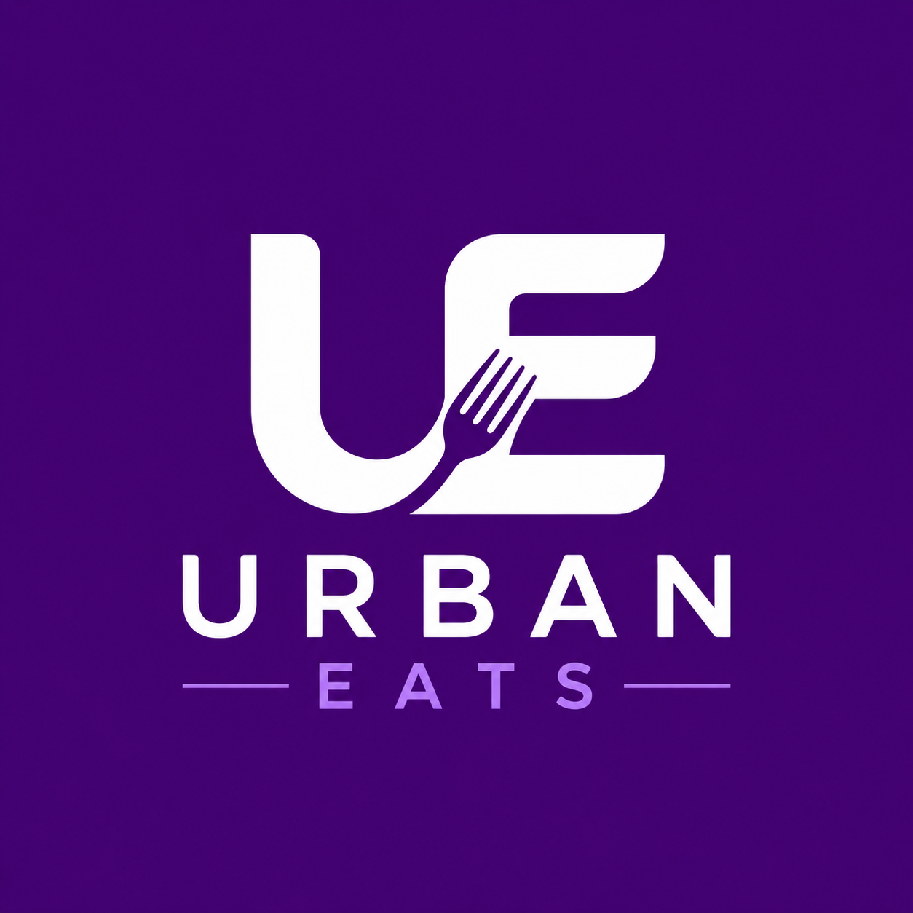
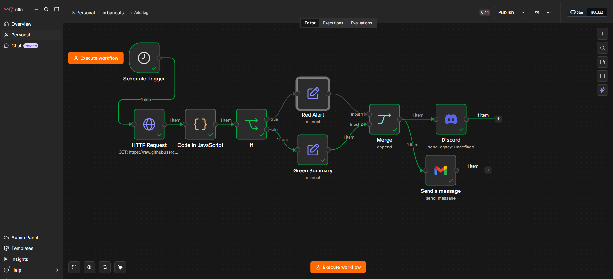
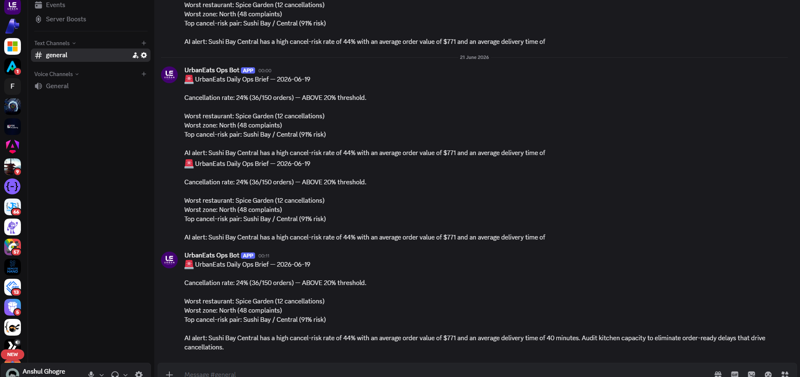
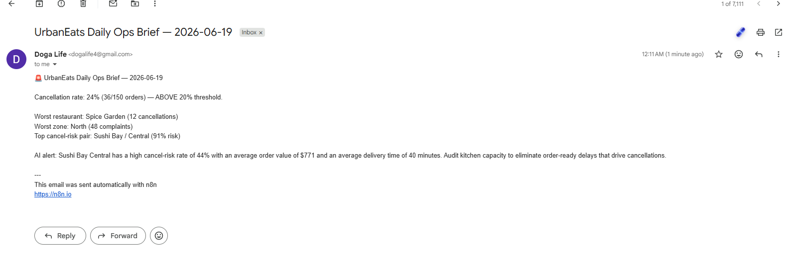

<p align="center">
  
</p>

<h1 align="center">UrbanEats — Risk Classifier + 07:30 Ops Brief</h1>

<p align="center">
  <em>From 150 raw orders → a daily cancellation-risk score → a 07:30 Discord + Gmail brief for the VP and regional managers.</em>
</p>

<p align="center">
  
  
  
  
</p>

---

## What this repo does

1. **C1 — Classifier** scores every order with a cancellation probability.
2. **C2 — Alert generator** rolls scores up to restaurant × zone hotspots and writes `urbaneats_daily_brief_input.csv`.
3. **n8n workflow** fires every morning at **07:30**, fetches that CSV, branches **Red Alert** vs. **Green Summary** on a 20% daily cancellation threshold, and dispatches to Discord + Gmail.

## This week's headline

> **Burger Hub – Central**, **80% high cancel-risk** (8 of 10 orders), avg delivery **67 min** vs ~50 min in healthy zones. Top single-order risk: **ORD00091** at p = 0.91.

---

## The n8n flow

<p align="center">
  
</p>

`Schedule 07:30` → `HTTP fetch CSV` → `Code (compute KPIs)` → `If (cancel_rate > 20%)` → `Discord webhook` + `Gmail SMTP`

---

## Proof it lands

<table>
<tr>
<td width="50%" align="center">
  <strong>Discord</strong><br/>
  
</td>
<td width="50%" align="center">
  <strong>Gmail</strong><br/>
  
</td>
</tr>
</table>

---

## Repo layout

```
.
├── notebooks/
│   ├── Urban_eats_classifier.ipynb       # C1 — order-level risk
│   ├── Urban_eats_ops_alerts_C2.ipynb    # C2 — restaurant×zone rollup + alert CSV
│   ├── UrbanEats_Y_Profilling.ipynb      # Y-Data profiling
│   └── Urban_Eats_GX.ipynb               # Great Expectations checks
├── N8N/urbaneats.json                    # Importable n8n workflow
├── data/                                 # Daily brief input CSV
├── reports/                              # Profiling + assessment HTML
├── images/                               # Logo + flow + PoC screenshots
├── part_e_ops_review_brief.md            # 11 AM verbal brief (Part E)
└── urbaneats_delivery_orders.csv         # Source: 150 orders
```

---

## About the demo data — why the brief is static today

The CSV at `data/urbaneats_daily_brief_input.csv` is a **frozen snapshot generated on 2026-06-20**. The n8n workflow re-fetches it every morning, so the **date in the header rolls forward** each day, but the underlying numbers don't — the same 150 orders are scored on every run.

In production, a nightly batch job (Airflow / GitHub Actions / Colab + papermill) would:

1. Pull the previous day's orders from the orders database.
2. Re-run C1 (classifier) and C2 (alert generator).
3. Overwrite `urbaneats_daily_brief_input.csv` at the same URL n8n hits.

**The n8n workflow itself is production-ready — only the upstream data refresh is mocked.** The assessment is about the pipeline design, not standing up a 24/7 refresh job, so this repo ships the workflow + a fixed input and documents the seam where the nightly job would plug in.

<details>
<summary>How to simulate daily freshness for a live demo</summary>

- **Easiest:** re-run `Urban_eats_ops_alerts_C2.ipynb` with a new random seed or a different date window, push the new CSV to GitHub — n8n picks it up at the next 07:30.
- **Medium:** add a `today - 1` filter inside C1/C2 so re-running before the demo genuinely changes the numbers.
- **Real:** GitHub Action on cron, runs the notebook via papermill nightly, commits the new CSV.

</details>

---

## Run it locally

```bash
# 1. Score orders + build the daily brief CSV
jupyter notebook notebooks/Urban_eats_classifier.ipynb
jupyter notebook notebooks/Urban_eats_ops_alerts_C2.ipynb

# 2. Import the workflow into n8n
#    n8n → Workflows → Import from File → N8N/urbaneats.json
#    Set credentials: Discord webhook URL + Gmail SMTP
#    Activate → next 07:30 fires the brief
```

---

## Known gaps (what the brief cannot tell you yet)

- **No rider/driver signal** — `rider_rating` exists but isn't scored; no `rider_id`, no shift, no dispatch lag.
- **No weather / traffic / time-of-day** — `order_date` filters only; no peak-hour or weather join.
- **No complaint reasons** — raw `customer_complaints` count only, no CSAT/NPS or reason codes.
- **No cost tie-out** — avg order value is shown, refund/margin impact is not.

So the brief can name the hotspot (Burger Hub – Central, 80%) but cannot yet separate **kitchen prep** from **dispatch** as the cause.

---

## The 4-week target

**Burger Hub – Central high cancel-risk rate: 80% → under 30%.**
Secondary watch: overall daily cancellation rate held under the 20% Red Alert threshold in the n8n brief.
